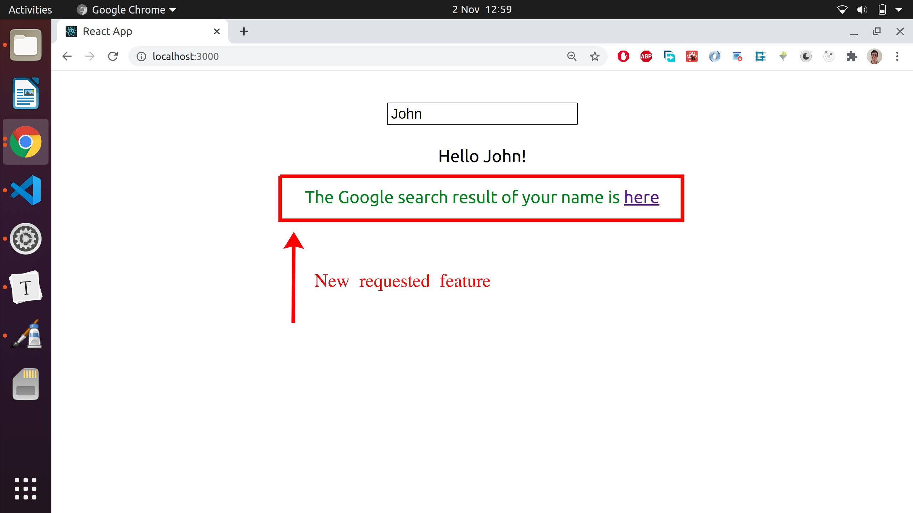
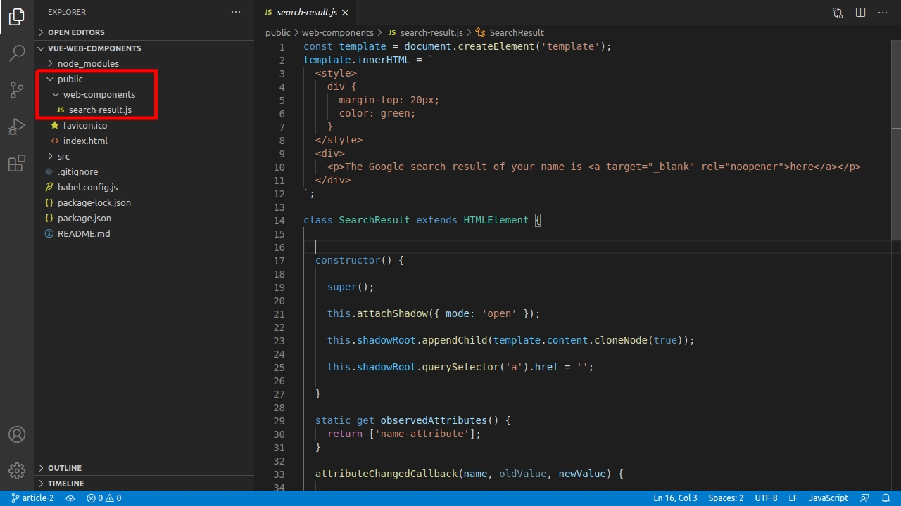
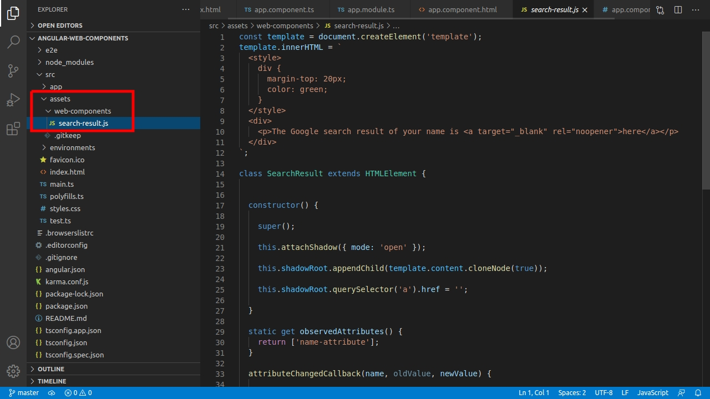

# Plugin based architecture with Web Components

**What do we do when some enterprise clients want a special feature in their app? Do we add it to the code base and bundle it with Webpack?** 

Lets dive in into the world of _plugin based architectures for enterprise apps using **Web Components**_ and learn how to save time and money when building them with **React, Vue and Angular** by dynamically importing them into our app, skipping the bundling process.

Also see an advanced use case by extending the functionality of the [Tour of Heroes](https://angular.io/tutorial)  Angular app, implementing an **advanced Web Component integration via a host Angular component**, to display the universe each hero belongs to. A [video](https://www.youtube.com/watch?v=CjbX5r5gvvo&ab_channel=Scotland%27sAngularMeetup) of [Scotland's Angular Meetup](https://www.youtube.com/channel/UCWIfQn9vUayDkzrrDIjdAjg) about this app is included!


Table of contents:

- ###### [Dealing with a new special feature request](#Dealing-with-a-new-special-feature-request)

- ###### [Basics of plugin based architecture using web components](#Basics-of-plugin-based-architecture-using-web-components)

  - [What is the code base?](#What-is-the-code-base?])

  - [Isolating the special feature in a Web Component](#Isolating-the-special-feature-in-a-Web-Component)

  - [Undertanding the app structure](#Undertanding-the-app-structure])

  - [Regular clients vs enterprise clients](#Regular-clients-vs-enterprise-clients)	

  - [Where in the code do enterprise clients can make changes?](#Where-in-the-code-do-enterprise-clients-can-make-changes?)

  - [Benefits of adding Web Components outside the code base](#Benefits-of-adding-Web-Components-outside-the-code-base)

- ###### [React demo](#React-demo)

- ###### [Vue demo](#Vue-demo)

- ###### [Angular demo](#Angular-demo)

- ###### [Digging deeper - An advanced use case in Angular-](#Digging-deeper-An-advanced-use-case-in-Angular)

  - [App Functionality overview](#App-Functionality-overview)

  - [App Structure](#App-Structure)

  - [Plugin Code](#Plugin-Code)


**Note 1: this article is based on this [Academind's article], that explains what Web Components are, with some demo apps explained and built step by step.**

**Note 2: if you copy and paste code snippets, it's recommended to avoid including the top comment that tells the name of the file, like `//App.js` or `//index.html`, because it may break your app.**

## Dealing with a new special feature request

In the enterprise world, all the files of a web app are installed in the client's private network, not exposed to the general public like you and me. So, the **client have access to the files and can modify some of them to get extra functionality** and we'll take advantage of this, as we're gonna see throughout this article. 

In the coming sections we're gonna explain and build a simple app in React, Vue and Angular; but first, lets understand the functionality of this app. 

Image that there are multiple enterprise clients with this basic app installed:


The app consists of an input field where users can type a their names, and below, there's a greeting message that outputs the entered name.

So, **all our clients are very happy** with this app, **but some of them want an extra feature**: they want to have a link that opens the result of a Google search for the entered name:




When clicking the `here` link, a new tab is opened showing the search result:


After this request, the development team who built the app can add a new component for the new feature into the code base, inside a React, Vue or Angular component, following a default approach. But nowadays, thanks to Web Components, there's another alternative: **the new feature can be isolated in a Web Component and can be imported dynamically into the code base.**

Lets find out more about this alternative in the coming sections.


## Basics of plugin based architecture using web components 

#### What is the code base?

The important thing to understand is that **there are parts of the code that are bundled for production, becoming part of the code base, and others don't.** The name of the folders that are part of the code base will vary with the framework or library you use. Lets take a look at what folders in the development phase are considered the be part of the code base:

| Framework/library | Code base | Not code base |
| ----------------- | --------- | ------------- |
| React & Vue       | `/src`    | `/public`     |
| Angular           | `src/app` | `/src/assets` |


#### Isolating the special feature in a Web Component

Instead of creating another normal a React, Vue or Angular component to contain the new special feature, the feature is added inside a Web Component built with Vanilla JavaScript. The code for the special feature requested is the following one, and will live in a `.js` file that we can name `search-result.js`:

```javascript
//search-result.js
//this is a Web Component, NOT a React,Vue or Angular component.

const template = document.createElement('template');
template.innerHTML = `
  <style>
    div {
      margin-top: 20px;
      color: green;
    }
  </style>
  <div>
    <p>The Google search result of your name is <a target="_blank" rel="noopener">here</a></p>
  </div>
`;

class SearchResult extends HTMLElement {

  constructor() {
    
    super();
    
    this.attachShadow({ mode: 'open' });
    
    this.shadowRoot.appendChild(template.content.cloneNode(true));
    
    this.shadowRoot.querySelector('a').href = '';
    
  }
  
  static get observedAttributes() {
    return ['name-attribute'];
  }
  
  attributeChangedCallback(name, oldValue, newValue) {
    
    if (name == 'name-attribute'){
      this.shadowRoot.querySelector('a').href = `https://www.google.com/search?q=${newValue}`;
    }

  }  
  
}

window.customElements.define('search-result', SearchResult);
```


#### Understanding the app structure

To understand the basics of the plugin based architecture in a more practical way, **lets take a look into a React App folder structure**.  If you don't know about React, don't worry, just look at the colored rectangles and their names. 

This first image shows the `/public` and `/src` folders of the project which contain **development files**:


Lets now see the files inside `/build`, which contains the **production files**:


**The `/build` folder contains the files that are delivered to clients**; when running the scripts for building the production files from the development ones, using the default [Webpack](https://webpack.js.org/) config,  the content of `/public` is copied and pasted untouched at the root level of `/build`, but the content of `/src` is bundled with [Webpack](https://webpack.js.org/), and put inside `/build/static`. To know more about the public folder used in React, read this [docs](https://create-react-app.dev/docs/using-the-public-folder/#:~:text=If%20you%20put%20a%20file,not%20be%20processed%20by%20webpack.&text=Only%20files%20inside%20the%20public,a%20part%20of%20the%20build) from [create-react-app.dev](https://create-react-app.dev).


#### Regular clients vs enterprise clients

**So, the the person in charge of managing the files installed in server that is used inside an enterprise within a private network, has access to the `/build` folder and can modify the files .** 

It's worth mentioning that enterprise clients are different than regular clients, who access the app from a public `url` and they can't modify the app files installed in the server. 

Lets imagine when you access a PWA like [Acedemind.com](https://academind.com/), as a regular user, through a public `url`: you can buy a course but you can't modify the files of the Web App in the server. You can modify them with Chrome dev tools in your Chrome browser, but just on your tab, without actually modifying the files in the server. The same app is served to **all** users around the world.


#### Where in the code do enterprise clients can make changes?

**The parts of the code modified by the clients are gonna be the public ones in production, OUTSIDE the code base.** They can tweak code inside `index.html` in the production build,  and add new folders containing Web Components there. 

Following a basic approach, inside `index.html`, the client can set a global variable that is either TRUE or FALSE (acting like a switch for a light in the house, to turn it ON and OFF), and that variable can be checked inside the code base to decide if the Web Component containing the special feature is gonna be used inside the app.

So, as a summary: **the part outside of the code base in the production build will have**:

```
1) An index.html file that sets a global variable.

2) A folder containing a Web Component with the special feature inside.
```


#### Benefits of adding Web Components outside the code base

The reasons to choose putting the Web Component outside the code base are:

-**Maintainability**: adding the Web Component outside the source code means that the component is NOT bundled by Webpack (or any other tool the bundles code in your app) and doesn't become part of the final JavaScript bundles.

This means that every time the development team wants to push changes to the app repo regarding the Web Component , this changes won't affect the source code, meaning less hassle for other development teams.

-**Have a dedicated team of developers** that can work on the Web Component independently of the team working on the code base.

-**Fewer updates** for all the users: if changes are made to the Web Component, the file containing it is **only** delivered to the clients interested in it, and not to **all** users.

It's worth to mention that the app bundles delivered to all users must be modified at least once in order to include some logic that allows the Web Component to be plugged in and be used in the bundles. But once this initial update has been delivered to ALL users, there's no need to modify the source code again, and the special feature can be modified as often as we want, without the need of subsequent code base updates.


As always, the best way to learn something is by doing, because **the retention rate in your brain is 10% when you are just reading, but 75% when doing it.** So, lets gets our hands dirty and build the app shown at the beginning of this article, containing the requested special feature, in React, Vue and Angular.


**Note: for the sake of keeping this article short, any polyfills to support Web Components will be added, but if you are interested in them, read this [Academind's article].**


## React Demo

The final React app can be found in this [gitHub repo](https://github.com/estebanmunchjones2019/react-web-components-plugin). Lets see how to build it by following these steps:

1) **Create a React project** by entering the following commands in your terminal, one at a time, to create a project called `react-web-components`:

```bash
npx create-react-app react-web-components
cd react-web-components
npm start
```


2) **Create the Web Component** containing the special feature that shows the Google search result link, in a file that we can name `search-result.js` inside a folder called  `web-components` that we have to create inside `/public`. So, the component will live in `/public/web-components/search-result.js`:


The Web Component's code was already shown in the [Isolating the special feature in a Web Component](#Isolating-the-special-feature-in-a-Web-Component) section, if you wanna copy and paste it.


3) **Modify `index.html`** by setting a global variable called `showSearchResult`  inside the `window` object, that lets the app decide to use or not the Web Component. 

Also, the Web Component must be imported. All the following code must be placed at the end of the `<body>`:

```html
//index.html

<script>
   window.showSearchResult = false;
</script>
<script src= "%PUBLIC_URL%/web-components/search-result.js"></script>

```

The `showSearchResult` variable is set to `false` because this is the default setup for **most** users. Remember that **just some** clients asked for the Google search result link.


4) **Modify `App.js`** to add the logic that checks the `showSearchResult`  variable value and displays the Web Component `<search-result>`:

```javascript
//App.js

import { useState } from 'react';

import './App.css';

function App() {

  const [name, setName] = useState('');

  return (
    <div className="App">
      
      <input 
      placeholder="Enter your name" 
      onChange={(event) => setName(event.target.value)}
      value={name}></input>

      <div className="greeting">Hello {name}!</div>

      {window.showSearchResult ? <search-result name-attribute={name}></search-result> : null}

  </div>
  );
} 

export default App; 
```


5) **Modify App.css** by writing this code inside:

```
//App.css

.App {
  text-align: center;
  margin-top: 30px;
}

.greeting {
  margin-top: 20px;
}
```


6) **Verify the app is working** by entering this command:

```bash
npm start
```

and opening the browser in `localhost:3000`. The Web Component should **not** appear on the screen. Try changing the `showSearchResult` variable to `true` inside `index.html` and check if the Web Component appears on the screen (it should). Then, try entering your name and then click the Google search link to see the result.

Change `showSearchResult` back to `false` in order to do the build in the next step.


7) **Build it** by running this command in the terminal:

````bash
npm run build
````


8) **Serve the build:**

We're gonna use the `http-server` server, so lets install it globally by running this:

```bash
npm i -g htttp-server
```

 Then, serve the built app by typing this in the terminal:

```bash
cd build
http-server
```

Open the browser on http://127.0.0.1:8080 or http://192.168.0.101:8080 and check again that the app is working fine. You shouldn't see the Web Component on the screen because the `showSearchResult` variable is set to `false`, in order not to show the special feature by default.

9) **Turn ON and OFF the special feature**:  

In your code editor, open `/build/index.html` and set the `showSearchResult` variable to `true` as if you were the administrator of the companies that asked for the Google search result feature. As the code was bundled and optimized, the `true` and `false` values are converted to `0` or `!0`.  

So, in `/build/index.html`, replace `window.showSearchResult=0` by `window.showSearchResult=!0`.

If you go to the browser again, you'll see that the special Google search feature is now displayed. This is the configuration that the companies which asked for the feature are gonna use in their networks.

That's it! **our React app has succesfully implemented a plugin based architecture with Web Components!**

Now, your app in production has a "switch" that enables or disables the special feature. Now this app could be delivered to **all** clients, and the clients that asked for the Google search result feature can enable it by themselves.


## Vue demo

Lets follow the same steps, but for a Vue app now. The final app can be found in this [gitHub repo](https://github.com/estebanmunchjones2019/vue-web-components-plugin).

1) **Install the Vue CLI globally:**

Open your terminal and run this command:

```bash
npm i -g @vue/cli
```

If you get an error telling you that there aren't permissions to access certain folders, just add the word `sudo` before the command, and enter your credentials.


2) **Create a new Vue project:**

Still in the terminal, run these commands (one at a time) to create a project called `vue-web-components`; feel free to choose other name as well.

```bash
vue create vue-web-components
cd vue-web-components
npm run start
```


3) **Create the Web Component** containing the special feature that shows the Google search result link, in a file that we can name `search-result.js` inside a folder called  `web-components` that we have to create inside `/public`. So, the component will live in `/public/web-components/search-result.js`:




The Web Component's code was already shown in the [Isolating the special feature in a Web Component](#Isolating-the-special-feature-in-a-Web-Component) section, if you wanna copy and paste it.


4) **Modify `index.html`** by setting a global variable called `showSearchResult`  inside the `window` object, that lets the app decide to use or not the Web Component. 

Also, the Web Component must be imported. All the following code must be placed at the end of the `<body>`:

```html
//index.html

<script>
   window.showSearchResult = false;
</script>
<script src= "/web-components/search-result.js"></script>

```

The `showSearchResult` variable is set to `false` because this is the default setup for **most** users. 


5) **Modify `App.js`** and to the logic that checks the `showSearchResult`  variable value and displays the Web Component `<search-result>`:

```vue
//App.vue

<template>
  <div class="App">
    
      <input 
      placeholder="Enter your name" 
      v-model="name">
      

      <div class="greeting">Hello {{ name }}!</div>

      <search-result v-if="showSearchResult" v-bind:name-attribute="name"></search-result>
  </div>
</template>

<script>
  
  export default {

    data() {
      return {
        name: '',
        showSearchResult: window.showSearchResult
      } 
  	} 

  }
</script>    

<style>
.App {
  margin-top: 30px;
  text-align: center;
}
.greeting {
  margin-top: 20px;
}
</style>
```


6) **Verify the app is working** by entering this command:

```bash
npm run serve
```

and opening the browser in `localhost:8080`. The Web Component should **not** appear on the screen. Try changing the `showSearchResult` variable to `true` inside `index.html` and check if the Web Component appears on the screen (it should). Then, try entering your name and then click the Google search link to see the result.

Change `showSearchResult` back to `false` in order to do the build in the next step.


7) **Build it**, by running:

```bash
npm run build
```


8) **Serve the build** by running these commands on the terminal:

```bash
cd dist
http-server
```

Open the browser on http://127.0.0.1:8080 or http://192.168.0.101:8080 and check again that the app is working fine. You shouldn't see the Web Component on the screen because the `showSearchResult` variable is set to `false` in order not to show the special feature by default.

9) **Turn ON and OFF the special feature**:  play around with `dist/index.html` following the same instructions from the step 9 of the React demo.


That's it! **our Vue app has succesfully implemented a plugin based architecture with Web Components!**


## Angular demo

Lets follow the same steps as above, but for an Angular app now. The final app can be found in this [gitHub repo](https://github.com/estebanmunchjones2019/angular-web-components-plugin).

1) **Install the Angular CLI globally:**

Open your terminal and run this command:

```bash
npm i -g @angular/cli
```

If you get an error telling you that there aren't permissions to access certain folders, just add the word `sudo` before the command, and enter your credentials.


2) **Create a new Angular project:**

Still in the terminal, run this commands (one at a time) to create a project called `angular-web-components`; feel free to choose other name as well.

```bash
ng new angular-web-components
cd angular-web-components
ng serve
```


3) **Create the Web Component** containing the special feature that shows the Google search result link, in a file that we can name `search-result.js` inside a folder called  `web-components` that we have to create inside `/src/assets`. So, the component will live in `/src/assets/web-components/search-result.js`:




The Web Component's code was already shown in the [Isolating the special feature in a Web Component](#Isolating-the-special-feature-in-a-Web-Component) section, if you wanna copy and paste it.


4) **Modify `index.html`** by setting a global variable called `showSearchResult`  that lets the app decide to use or not the Web Component. Angular lets us declare global variables and pick them up from the components or services, without the need of using the `window` object.

Also, the Web Component must be imported. All the following code must be added at the end of the `<body>`:

```html
//index.html

<script>
  var showSearchResult = false;
</script>
<script src= "assets/web-components/search-result.js"></script>
```

The `showSearchResult` variable is set to `false` because this is the default setup for **most** users. 


5) **Modify `app.component.ts`**: 

```typescript
//app.component.ts

import { Component } from '@angular/core';

declare var showSearchResult:boolean;

@Component({
  selector: 'app-root',
  templateUrl: './app.component.html',
  styleUrls: ['./app.component.css']
})
export class AppComponent {
  name: string;
  showSearchResult:boolean = showSearchResult
}

```


6) **Modify `app.component.html`** to add the logic that checks the `showSearchResult` variable value and displays the Web Component `<search-result>`:

```html
//app.component.html

<div class="App">
      
  <input 
  placeholder="Enter your name" 
  [(ngModel)]="name"
  >

  <div class="greeting">Hello {{name}}!</div>

  <search-result *ngIf="showSearchResult" [attr.name-attribute]="name"></search-result>

</div>  
```


7) **Modify `app.component.css`**:

```bash
//app.component.css

.App {
    text-align: center;
    margin-top: 30px;
  }
  
.greeting {
    margin-top: 20px;
}
```


8) **Verify the app is working** by entering this command:

```bash
ng serve
```

and opening the browser in `localhost:4200`. The Web Component should **not** appear on the screen. Try changing the `showSearchResult` variable to `true` inside `index.html` and check if the Web Component appears on the screen (it should). Then, try entering your name and then click the Google search link to see the result.

Change `showSearchResult` back to `false` in order to do the build in the next step


9) **Build it**, by running:

```bash
npm run build
```


10) **Serve the build**  by running these commands on the terminal:

```bash
cd dist/angular-web-components
http-server
```

Open the browser on http://127.0.0.1:8080 or http://192.168.0.101:8080 and check again that the app is working fine. You shouldn't see the Web Component on the screen because the `showSearchResult` variable is set to `false` in order not to show the special feature by default.


11) **Turn ON and OFF the special feature**: play around with `/dist/angular-web-components/index.html`  following the same instructions from the step 9 of the React demo.


That's it! **our Angular app has successfully implemented a plugin based architecture with Web Components!**


## Digging deeper - An advanced use case in Angular -

This app was developed on top of the [Tour of Heroes](https://angular.io/tutorial) app by [Nikos Tsokos](https://twitter.com/n_tsokos) -member of [Scotland's Angular Meetup](https://www.youtube.com/channel/UCWIfQn9vUayDkzrrDIjdAjg)  & Sr. Front End Engineer at [Symphonic](https://www.symphonicsoft.com/).-

You can download the app from this [gitHub repo](https://github.com/ntsokos/sam-web-component-plugins) and you can watch this [Youtube video](https://www.youtube.com/watch?v=CjbX5r5gvvo&ab_channel=Scotland%27sAngularMeetup) explaining this app in detail:

------------------COMMENT FOR MAX: the embeded video may not be mobile responsive-------------------------------------------

<iframe width="560" height="315" src="https://www.youtube.com/embed/CjbX5r5gvvo" frameborder="0" allow="accelerometer; autoplay; clipboard-write; encrypted-media; gyroscope; picture-in-picture" allowfullscreen></iframe>

#### App functionality overview

The main difference between this app and the one shown in the [Angular demo](#Angular-demo) is that `CUSTOM_ELEMENT_SCHEMA` in not added in the `schemas` array in `app.module.ts`. Instead, the Web Component is instantiated inside an Angular Component which has an empty template that acts has a host, and uses the `customElements.get()` method, which is a browser API.

Lets understand how the plugin is gonna affect the view, by looking at the app on the screen. The app has the plugin enabled by default. 

In the main view, if we click on `heroes`:


Now, we can add a new hero. Lets add `Hulk`:


And the "Hulk" hero is added, with a label telling the universe it belongs to:


That label is a special feature that not **all** users might want, and can be enabled and rendered on the screen by using a `Web Component` and a `global variable`.


#### App Structure

Inside `src/app`, there's a folder called `hero-plugin-host` that contains a file `hero-plugin-host.component.ts` with an Angular component inside, which is in charge of instantiating and rendering the Web Component on the screen.

Outside the code base, inside `/assets`, there's a file called `hero-inverse-indicator.js` that contains a Web Component, that can be used in the app if a global variable inside `index.html` is properly set.


#### Plugin code

Now, it's time to dive deeper into the code, and see how this plugin works. Lets start by looking at the code inside`/src/index.html`, where a global variable called `heroPlugins` is defined. The name of the strings inside the array must match the selector name of the Web Components we wanna use: as we have only one Web Component with a selector of `hero-universe-indicator`, a string with the same value is passed into the array. This way, in a more complex app, many new functionalities could be enabled passing more strings in the array.

```html
//index.html

<!doctype html>
<html lang="en">

<head>
  <meta charset="utf-8">
  <title>Tour of Heroes</title>
  <base href="/">
  <meta name="viewport" content="width=device-width, initial-scale=1">
  <link rel="icon" type="image/x-icon" href="favicon.ico">
</head>

<body>
  <app-root></app-root>
    
  <!-- defines a global variable that enables the special feature -->  
  <script>
    var heroPlugins = ['hero-universe-indicator'];
  </script>
  <!-- imports the Web Component, which will be available inside every Angular Component --> 
  <script src="assets/hero-universe-indicator.js"></script>
    
</body>

</html>
```


 The Angular host component named `hero-plugin-host.component.ts` has the following code:

```typescript
//hero-plugin-host.component.ts

import { Component, Input, ElementRef, OnChanges, SimpleChanges } from '@angular/core';
import { Hero } from '../hero';

//declares the variable defined in index.html
declare var heroPlugins: string[];

/** Serves all declared plugins */
@Component({
  selector: 'app-hero-plugin-host',
  //the template is empty initially, but filled with content at runtime
  template: ``,
  styleUrls: ['./hero-plugin-host.component.css']
})
export class HeroPluginHostComponent implements OnChanges {
  //accepts an input "hero" variable 
   @Input() hero: Hero;

  constructor(
    //injects the elRef object to interact with the template
    private elRef: ElementRef<HTMLElement>
  ) { }

  public ngOnChanges(_changes: SimpleChanges): void {
    //removes and adds pluggins every time any data-bound property of a directive changes 
    this.removePlugins();
    this.addPlugins();
  }

  private removePlugins(): void {
    const hostElement = this.elRef.nativeElement;
    let child = hostElement.lastElementChild;
    // it removes the last child of the hostElement while it exists
    while (!!child) {
      hostElement.removeChild(child);
      child = hostElement.lastElementChild;
    }
  }

  private addPlugins(): void {
    const hostElement = this.elRef.nativeElement;
	//loops through the heroPlugins array
    for (const elementName of heroPlugins) {
      const exists = customElements.get(elementName);
      //it consoles log a warning if the custom element doesn't exists.  
      if (!exists) {
        console.warn(`Custom element ${elementName} does not exist`);
        continue;
      }
	  //creates the HTML element specified by tagName (e.g 'hero-universe-indicator', already imported in index.tml	
      const customElement = document.createElement(elementName);
      //sets the value of the attribute 'data-hero-name' equal the the hero.name input 		  value passed to <app-hero-plugin-host>   
      customElement.setAttribute('data-hero-name', this.hero.name);

      // appends the element, so it's attached to the DOM
      hostElement.appendChild(customElement);
    }
  }

}

```


Lets look now at `hero-plugin-host.component.css`:

```css
//hero-plugin-host.component.css

:host {
    display: contents;
}
```


According to [MDN web docs](https://developer.mozilla.org/en-US/docs/Web/CSS/:host), the **`:host`** [CSS](https://developer.mozilla.org/en-US/docs/Web/CSS) [pseudo-class](https://developer.mozilla.org/en-US/docs/Web/CSS/Pseudo-classes) selects the shadow host of the [shadow DOM](https://developer.mozilla.org/en-US/docs/Web/Web_Components/Using_shadow_DOM) containing the CSS it is used inside — in other words, this **allows you to select a custom element from inside its shadow DOM.**

`display: contents` causes an element's children to appear as if they were direct children of the element's parent, ignoring the element itself. To find out more visit [this page](https://caniuse.com/css-display-contents#:~:text=display%3A%20contents%20causes%20an%20element's,grid%20or%20similar%20layout%20techniques.).

The Angular host element `<app-hero-plugin-host>` must be used somewhere in an Angular component in order to be rendered on the screen: it's used in `heroes.component.ts`.

```html
//heroes.component.ts

<h2>My Heroes</h2>

<div>
  <label>Hero name:
    <input #heroName />
  </label>
  <!-- (click) passes input value to add() and then clears the input -->
  <button (click)="add(heroName.value); heroName.value=''">
    add
  </button>
</div>

<ul class="heroes">
  <li *ngFor="let hero of heroes">
    <a routerLink="/detail/{{hero.id}}">
      <span class="badge">{{hero.id}}</span> {{hero.name}}
        
	  <!-- passes the hero object to the host Angular component -->
      <app-hero-plugin-host [hero]="hero"></app-hero-plugin-host>
        
    </a>
    <button class="delete" title="delete hero" (click)="delete(hero)">x</button>
  </li>
</ul>
```


The Web Component is located inside `/assests/hero-universe-indicator.js`: 

```javascript
//hero-universe-indicator.js

class HeroUniverseIndicator extends HTMLElement {
    
	//defines the observed attributes
	static get observedAttributes() {
		return ['data-hero-name'];
	}
	//executes the parent contructor and executes createAndAttachToDom() method right away when the component is created
	constructor() {
		super();
		this.createAndAttachToDom();
	}
	
	//-------------------isConnected is not defined. Mistake?---------------------------
    connectedCallback() {
		if (!this.isConnected) { return; }
		this.createAndAttachToDom();
	}
	//when 'data-hero-name' attribute changes, the createAndAttachToDom() method is executed
	attributeChangedCallback(name, oldValue, newValue) {
		this.createAndAttachToDom();
	}

	//#region dom element manipulation

	createAndAttachToDom() {
        //attaches the shadow DOM
		if (!this.shadowRoot) {
			this.attachShadow({ mode: 'open' });
		}

		// removes any existing children, just to be safe.
		this.removeShadowRootChildren();

		//adds some CSS to apply to the shadow dom
		const style = document.createElement('style');
		style.textContent = this.getStyleContent();
        //appends the <style> element to the shadow DOM to provide styling
		this.shadowRoot.appendChild(style);

		// Attaches the created elements to the shadow dom
		const childElement = this.getChildElement();
        //appends the <span> element with the hero's universe name
		this.shadowRoot.appendChild(childElement);
	}

	removeShadowRootChildren() {
		var child = this.shadowRoot.lastElementChild;
        //removes the last child while it exists
		while (child) {
			this.shadowRoot.removeChild(child);
			child = this.shadowRoot.lastElementChild;
		}
	}
	//returns the <span> element with the hero name inside
	getChildElement() {
        //defines the heroName that passed via an attribute
		const heroName = this.getAttribute('data-hero-name');
        //defines the hero universe, if it exists
		const universe = this.getHeroUniverse(heroName);
		//creates a <span> container element
		const spanElement = document.createElement('span');
		//if the universe exists, adds the content to the <span> element
		if (!!universe) {
			spanElement.innerText = universe;
			spanElement.classList.add(universe.toLowerCase());
		}

		return spanElement;
	}
	//returns the style content
	getStyleContent() {
		return `

		span {
			font-weight: bold;
		}

		span.marvel {
			background: red;
			color: white;
		}

		span.dc {
			background: white;
			color: blue;
		}

		span.got {
			background: black;
			color: yellow;
		}

		`;
	}
	//returns the hero universe from a defined set of heroes and universes
	getHeroUniverse(heroName) {
		const MARVEL_UNIVERSE = ['Wolverine', 'Spider Man', 'Thor', 'Iron Man', 'Hulk', 'Captain America', 'Daredevil', 'Punisher'];
		const DC_UNIVERSE = ['Superman', 'Batman', 'Flash', 'Green Lantern', 'Wonder Woman', 'Aquaman'];
		const GOT = ['Jaime Lannister', 'Cersei Lannister', 'Daenerys Targaryen', 'Jon Snow', 'Robb Stark', 'Sansa Stark', 'Arya Stark',
			'Theon Greyjoy', 'Joffrey Baratheon', 'Melisandre'];

		if (MARVEL_UNIVERSE.includes(heroName)) return 'Marvel';
		if (DC_UNIVERSE.includes(heroName)) return 'DC';
		if (GOT.includes(heroName)) return 'GOT';
		return '';
	}

	//#endregion

}

// Defines the new element in the customElements registry, which will be available as <hero-universe-indicator>
customElements.define('hero-universe-indicator', HeroUniverseIndicator);

```


That's all about _plugin based architectures with Web Components_. There are even more complex use cases, but the aim of this article is to give you an overview of this architecture. You can keep exploring and add new features to your apps with new Web Components. **Happy coding and have fun!**

