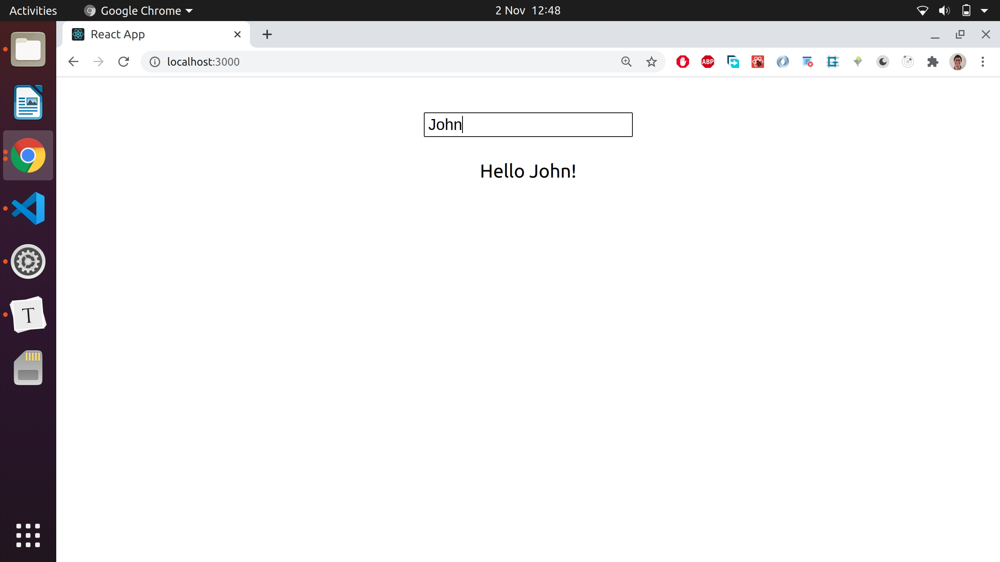
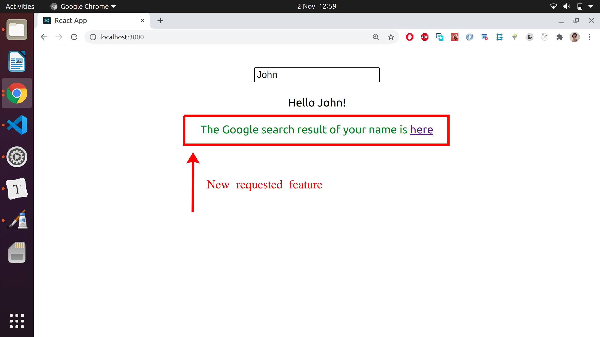
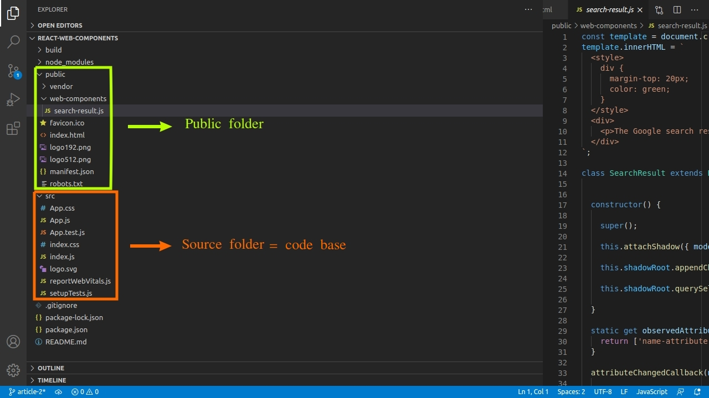
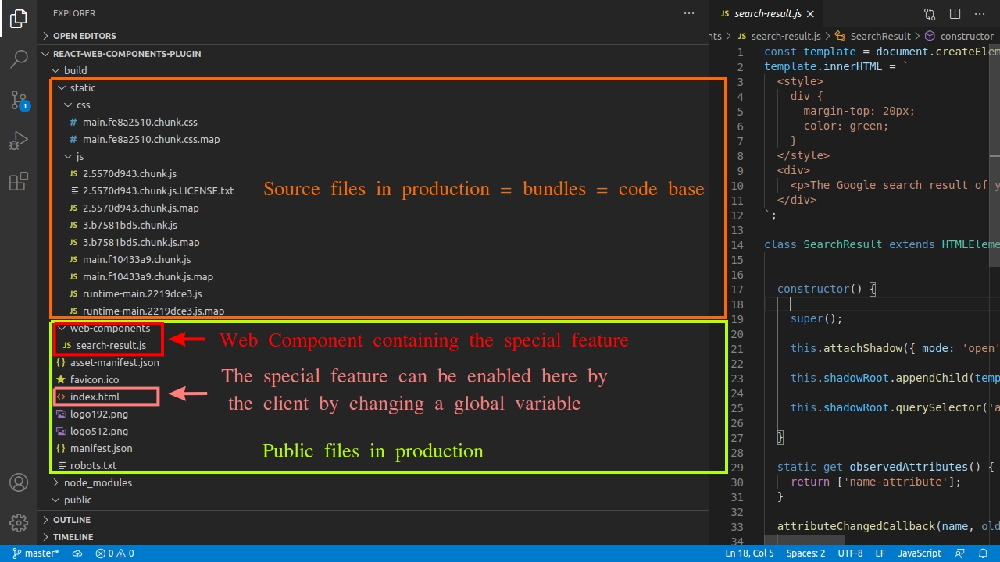
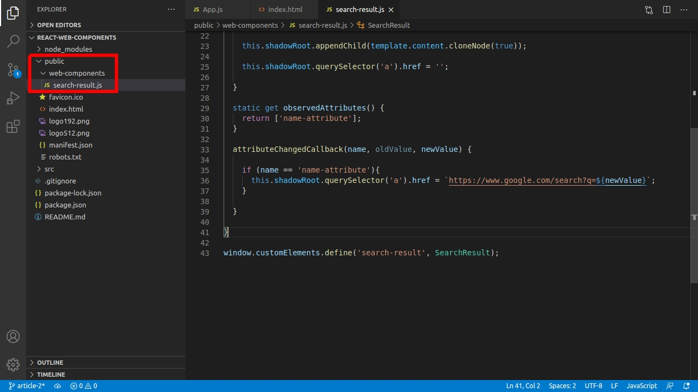

# Plugin based architecture with Web Components

**What do we do when some enterprise clients want a special feature in their apps? Do we add it to the code base?** 

Lets dive in into the world of _plugin based architectures for enterprise apps using **Web Components**_ and learn how to save time and money when building them with **React, Vue and Angular**.

Also learn an advanced use case by extending the functionality of the [Tour of Heroes Angular App](https://angular.io/tutorial), implementing an advanced Web Component integration with the app, to display the universe each hero belongs to.


Table of contents:

[Do we add special features in the source code?]

[What is a plugin based architecture?]

[React demo]

[Vue demo]

[Angular demo]

[Digging deeper: An Angular advanced use case demo]


**Note: this article is based on this [Academind's article], that explains what Web Components are, with some demo apps explained and built step by step.**

## Dealing with a new special feature request

In the enterprise world, all the files of a web app are installed in the client's private network of each company, not exposed to the general public. So, the **client have access to the files and can modify some of them to get extra functionality** and we'll take advantage of this, as we're gonna see throughout this article . 

Lets image that there are multiple enterprise clients with this basic app installed:




So, all our clients are very happy with this app, but one of them wants an extra feature: they want to have a link that opens the result of a Google search for the entered name:




After this request, the development team who built the app can add a new component for the new feature inside the code base, inside a React, Vue or Angular component, following a default approach. But nowadays, thanks to Web Components, there's another alternative: **the new feature can be isolated in a Web Component and can be injected from the outside into the code base.**

Lets find out more about this alternative in the coming sections.


## Basics of plugin based architecture using web components 

#### What is the code base?

The important thing to understand is that **there are parts of the code that are bundled for production, becoming part of the code base, and others don't.** The name of these folder will vary with the framework or library you use:

**React & Vue**:

Folder: `public` . Is its content bundled for production? `No`. Is it part of the code base? `No`.

Folder: `src`. Is its content bundled for production? `Yes`.  Is it part of the code base? `Yes`.

**Angular**:

Folder `src/assets`. Is its content bundled for production? `No`. Is it part of the code base? `No`.

Folder `src/app`. Is its content bundled for production? `Yes`. Is it part of the code base? `Yes`.


#### Isolating the special feature in Web Component

Instead of creating another normal a React, Vue or Angular component to contain the new special feature, the feature is added inside a Web Component:

```javascript
//a Web Component, not a React,Vue or Angular component.

const template = document.createElement('template');
template.innerHTML = `
  <style>
    div {
      margin-top: 20px;
      color: green;
    }
  </style>
  <div>
    <p>The Google search result of your name is <a target="_blank" rel="noopener">here</a></p>
  </div>
`;

class SearchResult extends HTMLElement {

  
  constructor() {
    
    super();
    
    this.attachShadow({ mode: 'open' });
    
    this.shadowRoot.appendChild(template.content.cloneNode(true));
    
    this.shadowRoot.querySelector('a').href = '';
    
  }
  
  static get observedAttributes() {
    return ['name-attribute'];
  }
  
  attributeChangedCallback(name, oldValue, newValue) {
    
    if (name == 'name-attribute'){
      this.shadowRoot.querySelector('a').href = `https://www.google.com/search?q=${newValue}`;
    }

  }  
  
}

window.customElements.define('search-result', SearchResult);
```


#### Undertanding the app structure:

To understand the basics of the plugin based architecture, **lets take a look into a React App folder structure**.  If you don't know about React, don't worry, just look at the colored rectangles and their names. 

This first image shows the `/public` and `/src` folders of the project which contain **development files**:




Lets now see the files inside `/build`, which contains the **production files**:



The `/build` folder contains the files that are delivered to clients; when running the scripts for building the production files from the development ones, using the default Webpack config,  the content of `/public` is copied and pasted untouched at the root level of  `/build`, but the content of `/src` is bundled with Webpack, and put inside `/static`. To know more about the public folder used in React, read this [docs](https://create-react-app.dev/docs/using-the-public-folder/#:~:text=If%20you%20put%20a%20file,not%20be%20processed%20by%20webpack.&text=Only%20files%20inside%20the%20public,a%20part%20of%20the%20build) from [create-react-app.dev](https://create-react-app.dev).

So, the the person in charge of managing the files installed in server that is used inside an enterprise with a private network, has access to the `/build` folder and can modify them. It's worth mentioning that enterprise clients are different than regular clients, who access the app from a public `url` and they can't modify the app files installed in the server. 

Lets imagine when you access a PWA like the one Starbucks serves at [app.starbucks.com](https://app.starbucks.com/). You, as a regular customer, access the PWA through a public `url` and then, you order the coffee, but you can't modify the files in the server. You can modify them with Chrome dev tools in your Chrome browser, but just on your tab, without actually modifying the files in the server. The same app is served to ALL users around the world.

**So, an enterprise app can be modified by the person in charge of it at each company, enabling special features. Keep this in mind.**

#### Where in the code do clients make changes?

The parts of the code modified by the clients are gonna be the ones OUTSIDE the code base. They can tweak code inside `index.html` in the production build,  and add new folders containing Web Components there. 

Inside `index.html` the client is gonna set a global variable that is either TRUE or FALSE (acting like a switch for a light in a house, to turn it ON and OFF), and that variable is gonna be checked inside the code base to decide if the Web Components containing the special feature is gonna be used inside the app. 

So, to clarify: **the part outside of the code base in the production build will have**:

```
1) An index.html file that sets a global variable.

2) A folder containing a Web Component with the special feature inside.
```


#### Benefits of adding Web Components outside the code base

The reasons to choose putting the Web Component outside the code base are:

-**Maintainability**: adding the Web Component outside the source code means that the component is NOT bundled by Webpack (or any other tool the bundles code in your app) and doesn't become part of the final JavaScript bundle. 

So, to be clear: **source code in development => JavaScript bundles in production**. In other words, the code base development is bundled for production.

This means that every time the development team wants to push changes to the app repo regarding the Web Component , this changes wont't affect the source code, meaning less hassle for other development teams.

-**Have a dedicated team of developers** that can work on the Web Components independently of the team working on the code base app.

-**Fewer updates** for all the users:

The changes in the app regarding the special feature inside the Web Component can be delivered ONLY to the clients interested in them, and not to ALL users.

It's worth to mention that the app bundles (code base) must be modified at least once in order to include some logic that allows the Web Component to be plugged in and be used in the bundles. But once this initial update has been delivered to ALL users, there's no need to modify the source code again, and the special feature can be modified as often as we want, without the need of subsequent code base updates.


As always, the best way to learn something is by doing, because the retention rate in your brain is 10% when just reading, and 75% when doing it. So, lets gets our hands dirty and build the app shown at the beginning of this article, containing the requested special feature,  in React, Vue and Angular. 


## React Demo

The final app can be found in this [gitHub repo]

1) **Create a React project** by entering the following commands in your terminal, one at a time:

```bash
npx create-react-app react-web-components
cd react-web-components
npm start
```


2) **Create a Web Component** containing the special feature that shows the Google search result link in a file that we can name `search-result.js` inside a folder called `web-components`, that we need to create inside `/public`. So, the component will live in `/public/web-components/search-result.js`:




The Web Component code was already shown in the [Isolating the special feature in Web Component](#Isolating-the-special-feature-in-Web-Component) section, if you wanna copy it.


3) **Modify `index.html`** by setting a global variable called `showSearchResult` that lets the app decide to use or not the Web Component.

```html
<script>
   const showSearchResult = true;
</script>
```


4) Modify `App.js` and add the logic that checks the `showSearchResult`  variable and displays the Web Component `<search-result>`:

```

```


