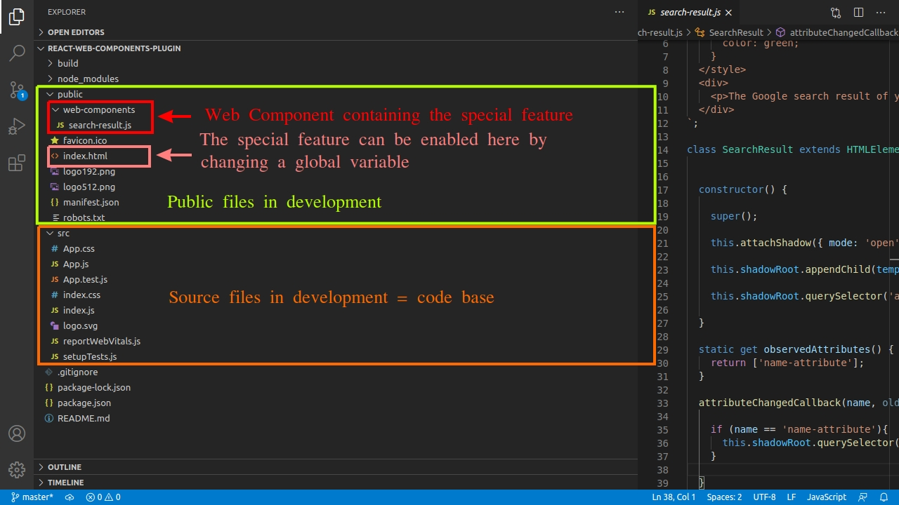

# Plugin based architectures with Web Components

**What if we add Web Components to an app and not bundle them?**

Lets dive in into the world of **plugin based architectures** using **Web Components** and learn how to plug them into **React, Vue and Angular** apps by dynamically importing them in our app from outside the code base, not bundling them.

Also see an advanced use case by extending the functionality of the [Tour of Heroes](https://angular.io/tutorial)  Angular app, implementing an **advanced Web Component integration via a host Angular component**, to display the universe each hero belongs to. A [video](https://www.youtube.com/watch?v=CjbX5r5gvvo&ab_channel=Scotland%27sAngularMeetup) by [Nikos Tsokos](https://twitter.com/n_tsokos) from [Scotland's Angular Meetup](https://www.youtube.com/channel/UCWIfQn9vUayDkzrrDIjdAjg) about this app is included in the last section!


Table of contents:

- ###### [Basics of Plugin based architectures](#basics-of-plugin-based-architectures)

  - [What is the code base?](#what-is-the-code-base])

  - [Importing Web Components in an app](#importing-web-components-in-an-app)

  - [What is a plugin architecture then?](#what-is-a-plugin-architecture-then)

  - [What are enterprise apps?](#what-are-enterprise-apps)

  - [What are the benefits of a plugin based architecture?](#what-are-the-benefits-of-a-plugin-based-architecture)

    

- ###### [Lets build an App!](#lets-build-an-app)

  * [App functionality](#app-functionality)
  * [Creating a Web Component](#creating-a-web-component)

- ###### [React demo](#react-demo)

- ###### [Vue demo](#vue-demo)

- ###### [Angular demo](#angular-demo)

- ###### [Digging deeper: an advanced use case in Angular](#digging-deeper:-an-advanced-use-case-in-angular)

  - [App Functionality overview](#app-functionality-overview)

  - [App Structure](#app-structure)

  - [Plugin Code](#plugin-code)


**Note: this article is based on this [Academind's article](https://academind.com/tutorials/web-components-introduction/), that explains what Web Components are, with some demo apps explained and built step by step.**


## Basics of Plugin based architectures

#### What is the code base?

When building apps, there are parts of the code that are bundled, becoming part of the code base, and others don't. The name of the folders that are part of the code base will vary with the framework or library you use. Lets take a look at what folders in the **development phase** are considered the be part of the code base:

| Framework/library | Code base            | Not code base |
| ----------------- | -------------------- | ------------- |
| React & Vue       | root level of `/src` | `/public`     |
| Angular           | `/src/app`           | `/src/assets` |

And here, in the **production phase**, these are the parts to be considered part the code base:

| Framework/library | Code base                 | Not code base                   |
| ----------------- | ------------------------- | ------------------------------- |
| React             | `/build/static`           | rest of the folders in `/build` |
| Vue               | `/dist/css` & `/build/js` | rest of the folders in `/dist`  |
| Angular           | `/dist`    *              | `/dist/assets`                  |

*(excluding  `index.html` and `favicon.ico` files,  and `dist/assets`)

By default, **the bundled files have random names**, like `main.fe8a2510.chunk.css` and this is done for the purpose of getting different file names every time we build the app, so the browser doesn't use a cached version of those production files. This way, we avoid been served an old version of the app in the browser.

A good way of **spotting files that belong to the code base** is by **looking at their names**; if they're random, they're part of it.


#### Importing Web Components in an app

When it comes to importing a Web Component in an app, there are two ways of doing it:

1) **Importing the Web Component's `.js` file inside a regular React, Vue or Angular component**, resulting in the Web Component being bundled and **becoming part of the code base**. 

This approach was used in the [An Introduction to Web Components](https://academind.com/tutorials/web-components-introduction/) where a Web Component was imported inside a React, Vue and Angular component with the following code:

````javascript
//Any React,Vue or Angular component

import './path-to-web-component-file';
````


2) **Importing the Web Component inside `index.html` file**, resulting in the Web Component **not being bundled** . **This is the first step for a plugin based architecture approach!**

The way of importing it is the following:

```html
<!--index.html of a React, Vue or Angular app -->

<script src="path-to-web-component-file"></script>
```


#### What is a plugin architecture then?

In a few words, is **implementing a new feature to an app but not making it part of the code base (not bundling it)**, using Web Components to build the feature in our case, **having a way to enable or disable the feature manually**, so, **being able to plug it or not to our app**.

There are **4 steps** to implement this type of architecture:

1) **Add the Web Component outside the code base folder**. This location depends on the framework or library we're using, as we saw in [this section](#what-is-the-code-base?).

2) **Import the Web Component in the `index.html` file**:

````html
<!-- index.html of a React, Vue or Angular app -->

<!-- import the Web Component -->
<script src="path-to-web-component-file"></script>
````

3) Then, **set a global variable** in the same file, to let the app decide whether the Web Component should be used or not in the app (plugged it or not), enabling the feature it provides:

````html
<!--index.html of a React, Vue or Angular app -->

//define a variable that acts like an ON/OFF switch.
<script>
    //for React and Vue apps
    window.showWebComponent = true;
    //for Angular apps
    var showWebComponent = true;
</script>

````

4) Use the global variable and the Web Component inside a React, Vue or Angular component:

````javascript
//some React, Vue or Angular component

//if the global variable is true =>
//use the web component by using its HTML selector:
<my-web-component></my-web-component>
````

In the code snippet above, some logic needs to be implemented (with an `if()` block or a ternary expression) to check the global variable value, and if it's `true`, use the Web Component HTML selector, to render it to the DOM and display on the screen the feature they provide.


#### What are enterprise apps?

Enterprise apps are software products delivered to companies (clients), and the apps might not be the same for all clients. They're usually installed in private networks, not exposed to the general public like you and me, and are designed for internal usage.

So, the people in charge of hosting these enterprise app **can make changes to the files, enabling features implemented with Web Components**.

On the other hand, apps like [academind.com](https://academind.com/) are considered regular apps, not enterprise ones, because the same app is delivered to everyone who enters to https://academind.com/, and there aren't any other online teaching companies using the same app.


#### What are the benefits of a plugin based architecture?

The reasons to choose importing the Web Component outside the code base are:

**1) Maintainability**: importing the Web Component outside the source code means that the component is not bundled by Webpack (or any other tool the bundles the code in your app) and hence doesn't become part of the final bundles.

This means that every time the development team wants to push changes to the app repo regarding the Web Component , this changes won't affect the source code, meaning less hassle for other development teams.

**2) Have a dedicated team of developers** that can work on the Web Component independently of the team working on the code base, because the app is split into two separate units: the code base and the Web Component.

**3) Fewer updates** on [enterprise apps]():  if changes are made to the Web Component, the file containing it is **only** delivered to the clients interested in the feature it provides, and not to **all** clients. 


## Lets build an app!

As always, the best way to learn something is by doing, because **the retention rate in your brain is 10% when you are just reading, but 75% when doing it.** 

So, lets build the **same app** we built together in [An Introduction to Web Components](https://academind.com/tutorials/web-components-introduction/) article, but **with the plugin based architecture**,  with the following differences: 

|                                               | [An Introduction to Web Components article's](https://academind.com/tutorials/web-components-introduction/) app | The new app (applying the plugin based architecture)         |
| --------------------------------------------- | ------------------------------------------------------------ | ------------------------------------------------------------ |
| Where to place the Web Component's `.js` file | Inside the code base                                         | Outside the code base                                        |
| How to import the Web Component in the app    | Inside a React, Vue or Angular component                     | inside `index.html`                                          |
| Is a global variable declared?                | No                                                           | Yes, inside `index.html`                                     |
| Is the Web Component conditionally rendered   | No                                                           | Yes, by checking  the global variable inside a React, Vue or Angular component. |

If you have already read [An Introduction to Web Components's article](https://academind.com/tutorials/web-components-introduction/), feel free to skip this part and focus instead on how the architecture is applied for the [React](#react-demo), [Vue](#vue-demo), and [Angular](#angular-demo) demos.


#### App functionality:

Image that we have a simple [enterprise app](#what-are-enterprise-apps) that greets the name we enter in the input form:


Now, **one enterprise client wants to add a new feature** which is a link that opens the result of a Google search for the entered name. 


When clicking the `here` link, a new tab is opened showing the search result:


#### Creating a Web Component:

Instead of creating another normal a React, Vue or Angular component to contain the new special feature, the feature is added inside a Web Component built with Vanilla JavaScript. The code for the special feature requested is the following one, and will live in a `.js` file that we can name `search-result.js`:

```javascript
//search-result.js
//this is a Web Component, NOT a React,Vue or Angular component.

const template = document.createElement('template');
template.innerHTML = `
  <style>
    div {
      margin-top: 20px;
      color: green;
    }
  </style>
  <div>
    <p>The Google search result of your name is <a target="_blank" rel="noopener">here</a></p>
  </div>
`;

class SearchResult extends HTMLElement {

  constructor() {
    
    super();
    
    this.attachShadow({ mode: 'open' });
    
    this.shadowRoot.appendChild(template.content.cloneNode(true));
    
    this.shadowRoot.querySelector('a').href = '';
    
  }
  
  static get observedAttributes() {
    return ['name-attribute'];
  }
  
  attributeChangedCallback(name, oldValue, newValue) {
    
    if (name == 'name-attribute'){
      this.shadowRoot.querySelector('a').href = `https://www.google.com/search?q=${newValue}`;
    }

  }  
  
}

window.customElements.define('search-result', SearchResult);
```


**Note: for the sake of keeping this article short, any polyfills to support Web Components will be added to the following React, Vue and Angular apps, but if you are interested in adding them, read  [An Introduction to Web Components's article](https://academind.com/tutorials/web-components-introduction/).**


## React Demo

The final React app can be found in this [gitHub repo](https://github.com/estebanmunchjones2019/react-web-components-plugin). Lets see how to build it by following these steps:

1) **Create a React project** by entering the following commands in your terminal, one at a time, to create a project called `react-web-components`:

```bash
npx create-react-app react-web-components
cd react-web-components
npm start
```


2) **Create the Web Component** containing the special feature that shows the Google search result link, in a file that we can name `search-result.js` inside a folder called  `web-components` that we have to create **inside `/public`**. So, the component will live in `/public/web-components/search-result.js`.

The Web Component's code was already shown in the [Creating a Web Component](#creating-a-web-component) section, if you wanna copy and paste it.


3) **Modify `index.html`** by setting a global variable called `showSearchResult`  inside the `window` object, that lets the app decide whether to use or not the Web Component. 

Also, the Web Component must be imported. All the following code must be placed at the end of the `<body>`:

```html
<!-- index.html -->

<!-- define the global variable, set to false by default -->
<script>
   window.showSearchResult = false;
</script>

<!-- import the Web Component -->
<script src= "%PUBLIC_URL%/web-components/search-result.js"></script>

```

The `showSearchResult` variable is set to `false` because this is the default setup for **most** users. The idea is that the enterprise client who asked for the special feature enables it, and the rest of the clients keep using the app as it is.


4) **Modify `App.js`** to add the logic that checks the `showSearchResult`  variable value and renders the Web Component `<search-result>`:

```javascript
//App.js

import { useState } from 'react';

import './App.css';

function App() {

  const [name, setName] = useState('');

  return (
    <div className="App">
      
      <input 
      placeholder="Enter your name" 
      onChange={(event) => setName(event.target.value)}
      value={name}></input>

      <div className="greeting">Hello {name}!</div>

	  //check the global variable value to render or not the feature
      {window.showSearchResult ? <search-result name-attribute={name}></search-result> : null}

  </div>
  );
} 

export default App; 
```


5) **Modify App.css** by writing this code inside:

```css
/* App.css */

.App {
  text-align: center;
  margin-top: 30px;
}

.greeting {
  margin-top: 20px;
}
```


6) **Verify the app is working** by entering this command:

```bash
npm start
```

and opening the browser in `localhost:3000`. The Web Component should **not** appear on the screen. Try changing the `showSearchResult` variable to `true` inside `index.html` and check if the Web Component appears on the screen (it should). Then, try entering your name and then click the Google search link to see the result.

Change `showSearchResult` back to `false` in order to do the build step.


7) **Build it** by running this command in the terminal:

````bash
npm run build
````


8) **Serve the build:**

We're gonna use the `http-server` server, so lets install it globally by running this:

```bash
npm i -g htttp-server
```

 Then, serve the built app by typing this in the terminal:

```bash
cd build
http-server
```

Open the browser on http://127.0.0.1:8080 or http://192.168.0.101:8080 and check again that the app is working fine. You shouldn't see the Web Component on the screen because the `showSearchResult` variable was set to `false`, in order not to show the special feature by default.

9) **Turn ON and OFF the special feature**:  

In your code editor, open `/build/index.html` and set the `showSearchResult` variable to `true`. As the code was bundled and optimized, the `true` and `false` values are converted to `0` or `!0`.  

So, in `/build/index.html`, replace `window.showSearchResult=0` by `window.showSearchResult=!0`.

Now, the enterprise client that requested the new feature has an app with a switch to enable or plugin the new functionality, without the need of creating new builds. 

Also try to change the color of the Web Component feature by replacing `green` by `red`:

````javascript
// build/web-components/search-result.js

template.innerHTML = `
  <style>
    div {
      margin-top: 20px;
      color: red;
    }
  </style>
  <div>
    <p>The Google search result of your name is <a target="_blank" rel="noopener">here</a></p>
  </div>
`;
````


Now, the Web Component feature should be red instead of green. But, why is this so great?: as the Web Component is not bundled, we can still change the code inside the `/build/web-components/search-result.js` file without the need of building the app again.

That's it! **our React app has successfully implemented a plugin based architecture with Web Components!**


#### Understanding the app structure

Before we dive into the Vue app, lets understand the app structure in development and production of the React version.

This first image shows the `/public` and `/src` folders of the project which contain **development files**, where you coded or pasted the code of the previous snippets.




Lets now see the files inside `/build`, which contains the **production files**, which are generated after running `npm run build`, and delivered to enterprise clients as a software product.


**The `/build` folder contains the files that are delivered to enterprise clients**; when running the scripts for building the production files from the development ones, using the default [Webpack](https://webpack.js.org/) config,  the content of `/public` is copied and pasted untouched at the root level of `/build`, but the content of `/src` is bundled with [Webpack](https://webpack.js.org/), and put inside `/build/static`. To know more about the public folder used in React, read this [docs](https://create-react-app.dev/docs/using-the-public-folder/#:~:text=If%20you%20put%20a%20file,not%20be%20processed%20by%20webpack.&text=Only%20files%20inside%20the%20public,a%20part%20of%20the%20build) from [create-react-app.dev](https://create-react-app.dev).


## Vue demo

Lets follow the same steps, but for a Vue app now. The final app can be found in this [gitHub repo](https://github.com/estebanmunchjones2019/vue-web-components-plugin).

1) **Install the Vue CLI globally:**

Open your terminal and run this command:

```bash
npm i -g @vue/cli
```

If you get an error telling you that there aren't permissions to access certain folders, just add the word `sudo` before the command, and enter your credentials.


2) **Create a new Vue project:**

Still in the terminal, run these commands (one at a time) to create a project called `vue-web-components`; feel free to choose other name as well.

```bash
vue create vue-web-components
cd vue-web-components
npm run start
```


3) **Create the Web Component** containing the special feature that shows the Google search result link, in a file that we can name `search-result.js` inside a folder called  `web-components` that we have to create **inside `/public`**. So, the component will live in `/public/web-components/search-result.js`.

The Web Component's code was already shown in the [Creating a Web Component](#creating-a-web-component) section, if you wanna copy and paste it.


4) **Modify `index.html`** by setting a global variable called `showSearchResult`  inside the `window` object, that lets the app decide whether to use or not the Web Component. 

Also, the Web Component must be imported. All the following code must be placed at the end of the `<body>`:

```html
<!-- index.html -->

<!-- define the global variable, set to false by default -->
<script>
   window.showSearchResult = false;
</script>

<!-- import the Web Component -->
<script src= "/web-components/search-result.js"></script>

```

The `showSearchResult` variable is set to `false` because this is the default setup for **most** users. 


5) **Modify `App.js`** to assign the global variable to a component's variable and add the logic that checks the latter variable's value and renders the Web Component `<search-result>`:

```vue
//App.vue

<template>
  <div class="App">
    
      <input 
      placeholder="Enter your name" 
      v-model="name">
      

      <div class="greeting">Hello {{ name }}!</div>
      
	  <!-- check the component variable value to render or not the feature -->
      <search-result v-if="showSearchResult" v-bind:name-attribute="name"></search-result>
  </div>
</template>

<script>
  
  export default {

    data() {
      return {
        name: '',
        //assign the global variable to a component scoped variable  
        showSearchResult: window.showSearchResult
      } 
  	} 

  }
</script>    

<style>
.App {
  margin-top: 30px;
  text-align: center;
}
.greeting {
  margin-top: 20px;
}
</style>
```


6) **Verify the app is working** by entering this command:

```bash
npm run serve
```

and opening the browser in `localhost:8080`. The Web Component should **not** appear on the screen. Try changing the `showSearchResult` variable to `true` inside `index.html` and check if the Web Component appears on the screen (it should). Then, try entering your name and then click the Google search link to see the result.

Change `showSearchResult` back to `false` in order to do the build step.


7) **Build it**, by running:

```bash
npm run build
```


8) **Serve the build** by running these commands on the terminal:

```bash
cd dist
http-server
```

Open the browser on http://127.0.0.1:8080 or http://192.168.0.101:8080 and check again that the app is working fine. You shouldn't see the Web Component on the screen because the `showSearchResult` variable was set to `false` in order not to show the special feature by default.

9) **Turn ON and OFF the special feature**:  play around with `dist/index.html` following the same instructions from the step 9 of the [React demo](#react-demo).


That's it! **our Vue app has successfully implemented a plugin based architecture with Web Components!**


## Angular demo

Lets follow the same steps as above, but for an Angular app now. The final app can be found in this [gitHub repo](https://github.com/estebanmunchjones2019/angular-web-components-plugin).

1) **Install the Angular CLI globally:**

Open your terminal and run this command:

```bash
npm i -g @angular/cli
```

If you get an error telling you that there aren't permissions to access certain folders, just add the word `sudo` before the command, and enter your credentials.


2) **Create a new Angular project:**

Still in the terminal, run this commands (one at a time) to create a project called `angular-web-components`; feel free to choose other name as well.

```bash
ng new angular-web-components
cd angular-web-components
ng serve
```


3) Enable the use of Web Components, by adding a `schemas` property inside the `@NgModule` config in `app.module.ts`, and pass it an array with the `CUSTOM_ELEMENTS_SCHEMA` const. This allows Angular to understand the HTML Web Component selector, because it's a non-Angular component.

`````typescript
//app.module.ts

import { BrowserModule } from '@angular/platform-browser';

//import the CUSTOM_ELEMENTS_SCHEMA constant
import { NgModule, CUSTOM_ELEMENTS_SCHEMA } from '@angular/core';
import { FormsModule } from '@angular/forms';

import { AppComponent } from './app.component';

@NgModule({
  declarations: [
    AppComponent
  ],
  imports: [
    BrowserModule,
    FormsModule
  ],
  providers: [],
    
   //add the schemas property and pass the CUSTOM_ELEMENTS_SCHEMA constant
  schemas: [CUSTOM_ELEMENTS_SCHEMA],
  bootstrap: [AppComponent]
})
export class AppModule { } 
`````


4) **Create the Web Component** containing the special feature that shows the Google search result link, in a file that we can name `search-result.js` inside a folder called  `web-components` that we have to create **inside `/src/assets`**. So, the component will live in `/src/assets/web-components/search-result.js`.

The Web Component's code was already shown in the [Creating a Web Component](#creating-a-web-component) section, if you wanna copy and paste it.


5) **Modify `index.html`** by setting a global variable called `showSearchResult`  that lets the app decide whether to use or not the Web Component. Angular lets us declare global variables and pick them up from the components or services, without the need of using the `window` object.

Also, the Web Component must be imported. All the following code must be added at the end of the `<body>`:

```html
<!--index.html -->

<!-- define the global variable, set to false by default -->
<script>
  var showSearchResult = false;
</script>

<!-- import the Web Component -->
<script src= "assets/web-components/search-result.js"></script>
```

The `showSearchResult` variable is set to `false` because this is the default setup for **most** users. 


6) **Modify `app.component.ts`**: 

```typescript
//app.component.ts

import { Component } from '@angular/core';

declare var showSearchResult:boolean;

@Component({
  selector: 'app-root',
  templateUrl: './app.component.html',
  styleUrls: ['./app.component.css']
})
export class AppComponent {
  name: string;
    
  //asign the global variable to a component property  
  showSearchResult:boolean = showSearchResult
}

```


7) **Modify `app.component.html`** to add the logic that checks the `showSearchResult` variable value and renders the Web Component `<search-result>`:

```html
<!-- app.component.html -->

<div class="App">
      
  <input 
  placeholder="Enter your name" 
  [(ngModel)]="name"
  >

  <div class="greeting">Hello {{name}}!</div>
    
  <!-- check the component property value to render or not the feature -->
  <search-result *ngIf="showSearchResult" [attr.name-attribute]="name"></search-result>

</div>  
```


8) **Modify `app.component.css`**:

```css
/* app.component.css */

.App {
    text-align: center;
    margin-top: 30px;
  }
  
.greeting {
    margin-top: 20px;
}
```


9) **Verify the app is working** by entering this command:

```bash
ng serve
```

and opening the browser in `localhost:4200`. The Web Component should **not** appear on the screen. Try changing the `showSearchResult` variable to `true` inside `index.html` and check if the Web Component appears on the screen (it should). Then, try entering your name and then click the Google search link to see the result.

Change `showSearchResult` back to `false` in order to do the build step.


10) **Build it**, by running:

```bash
ng build --prod
```


11) **Serve the build**  by running these commands on the terminal:

```bash
cd dist/angular-web-components
http-server
```

Open the browser on http://127.0.0.1:8080 or http://192.168.0.101:8080 and check again that the app is working fine. You shouldn't see the Web Component on the screen because the `showSearchResult` variable is set to `false` in order not to show the special feature by default.


12) **Turn ON and OFF the special feature**: play around with `/dist/angular-web-components/index.html`  following the same instructions from the step 9 of the [React demo](#react-demo).


That's it! **our Angular app has successfully implemented a plugin based architecture with Web Components!**


## Digging deeper: an advanced use case in Angular

This app was developed on top of the [Tour of Heroes](https://angular.io/tutorial) app by [Nikos Tsokos](https://twitter.com/n_tsokos) -member of [Scotland's Angular Meetup](https://www.youtube.com/channel/UCWIfQn9vUayDkzrrDIjdAjg)  & Sr. Front End Engineer.

You can download the app from this [gitHub repo](https://github.com/ntsokos/sam-web-component-plugins) and you can watch this [Youtube video](https://www.youtube.com/watch?v=CjbX5r5gvvo&ab_channel=Scotland%27sAngularMeetup) explaining this app in detail:


------------------COMMENT FOR MAX: the embeded video may not be mobile responsive-------------------------------------------


<iframe width="560" height="315" src="https://www.youtube.com/embed/CjbX5r5gvvo" frameborder="0" allow="accelerometer; autoplay; clipboard-write; encrypted-media; gyroscope; picture-in-picture" allowfullscreen></iframe>

#### App functionality overview

The main difference between this app and the one shown in the [Angular demo](#angular-demo) is that `CUSTOM_ELEMENT_SCHEMA` in not added in the `schemas` array in `app.module.ts`. Instead, the **Web Component is instantiated inside an Angular Component which has an empty template that acts has a host**, and uses the `customElements.get()` method, which is a browser API.

Lets understand how the plugin is gonna affect the view, by looking at the app on the screen. In this case, the app has the plugin enabled by default. 

In the main view, if we click on `heroes`:


Now, we can add a new hero. Lets add `Hulk`:


And the "Hulk" hero is added, with a label telling the universe it belongs to:


That label is a special feature that not **all** users might want, and can be enabled and rendered on the screen by using a `Web Component` and a `global variable`.


#### App Structure

Inside `src/app`, there's a folder called `hero-plugin-host` that contains a file `hero-plugin-host.component.ts` with an Angular component inside, which is in charge of instantiating and rendering the Web Component on the screen.

Outside the code base, inside `/assets`, there's a file called `hero-inverse-indicator.js` that contains a Web Component, that can be used in the app if a global variable inside `index.html` is properly set.


#### Plugin code

Now, it's time to dive deeper into the code, and see how this plugin works. Lets start by looking at the code inside`/src/index.html`, where a global variable called `heroPlugins` is defined.

The name of the strings inside the array must match the selector name of the Web Components we wanna use in the app: as we only have one Web Component with a selector of `hero-universe-indicator`, a string with the same value is passed into the array. 

This way, in a more complex app, many new functionalities could be enabled by passing more strings in the array.

```html
<!-- index.html -->

<!doctype html>
<html lang="en">

<head>
  <meta charset="utf-8">
  <title>Tour of Heroes</title>
  <base href="/">
  <meta name="viewport" content="width=device-width, initial-scale=1">
  <link rel="icon" type="image/x-icon" href="favicon.ico">
</head>

<body>
  <app-root></app-root>
    
  <!-- define a global variable that enables the special feature -->  
  <script>
    var heroPlugins = ['hero-universe-indicator'];
  </script>
    
  <!-- import the Web Component, which will be available inside every Angular Component --> 
  <script src="assets/hero-universe-indicator.js"></script>   
</body>

</html>
```


 The Angular host component named `hero-plugin-host.component.ts` has the following code:

```typescript
//hero-plugin-host.component.ts

import { Component, Input, ElementRef, OnChanges, SimpleChanges } from '@angular/core';
import { Hero } from '../hero';

//declare the global variable defined in index.html
declare var heroPlugins: string[];

/** Serve all declared plugins */
@Component({
  selector: 'app-hero-plugin-host',
  //the template is empty initially, but filled with content at runtime
  template: ``,
  styleUrls: ['./hero-plugin-host.component.css']
})
export class HeroPluginHostComponent implements OnChanges {
  //accept an input "hero" variable 
   @Input() hero: Hero;

  constructor(
    //inject the elRef object to interact with the template
    private elRef: ElementRef<HTMLElement>
  ) { }

  public ngOnChanges(_changes: SimpleChanges): void {
    //remove and add pluggins every time any data-bound property of a directive changes 
    this.removePlugins();
    this.addPlugins();
  }

  private removePlugins(): void {
    const hostElement = this.elRef.nativeElement;
    let child = hostElement.lastElementChild;
    //remove the last child of the hostElement while it exists
    while (!!child) {
      hostElement.removeChild(child);
      child = hostElement.lastElementChild;
    }
  }

  private addPlugins(): void {
    const hostElement = this.elRef.nativeElement;
	//loop through the heroPlugins array
    for (const elementName of heroPlugins) {
      const exists = customElements.get(elementName);
      //console log a warning if the custom element doesn't exists.  
      if (!exists) {
        console.warn(`Custom element ${elementName} does not exist`);
        continue;
      }
	  //create the HTML element specified by tagName (e.g 'hero-universe-indicator', already imported in index.tml	
      const customElement = document.createElement(elementName);
      //set the value of the attribute 'data-hero-name' equal the the hero.name input 		  value passed to <app-hero-plugin-host>   
      customElement.setAttribute('data-hero-name', this.hero.name);

      // append the element, so it's attached to the DOM
      hostElement.appendChild(customElement);
    }
  }

}

```


Lets look now at `hero-plugin-host.component.css`:

```css
/* hero-plugin-host.component.css */

:host {
    display: contents;
}
```


According to [MDN web docs](https://developer.mozilla.org/en-US/docs/Web/CSS/:host), the **`:host`** [CSS](https://developer.mozilla.org/en-US/docs/Web/CSS) [pseudo-class](https://developer.mozilla.org/en-US/docs/Web/CSS/Pseudo-classes) selects the shadow host of the [shadow DOM](https://developer.mozilla.org/en-US/docs/Web/Web_Components/Using_shadow_DOM) containing the CSS it is used inside — in other words, this **allows you to select a custom element from inside its shadow DOM.**

`display: contents` causes an element's children to appear as if they were direct children of the element's parent, ignoring the element itself. To find out more visit [this page](https://caniuse.com/css-display-contents#:~:text=display%3A%20contents%20causes%20an%20element's,grid%20or%20similar%20layout%20techniques.).

The Angular host element `<app-hero-plugin-host>` must be used somewhere in an Angular component in order to be rendered on the screen: it's used in `heroes.component.html`.

```html
<!-- heroes.component.html -->

<h2>My Heroes</h2>

<div>
  <label>Hero name:
    <input #heroName />
  </label>
  <!-- when clicked, pass the input value to add() and then clear the input -->
  <button (click)="add(heroName.value); heroName.value=''">
    add
  </button>
</div>

<ul class="heroes">
  <li *ngFor="let hero of heroes">
    <a routerLink="/detail/{{hero.id}}">
      <span class="badge">{{hero.id}}</span> {{hero.name}}
        
	  <!-- pass the hero object to the host Angular component -->
      <app-hero-plugin-host [hero]="hero"></app-hero-plugin-host>
        
    </a>
    <button class="delete" title="delete hero" (click)="delete(hero)">x</button>
  </li>
</ul>
```


The Web Component is located inside `/assests/hero-universe-indicator.js`: 

```javascript
//hero-universe-indicator.js

class HeroUniverseIndicator extends HTMLElement {
    
	//define the observed attributes
	static get observedAttributes() {
		return ['data-hero-name'];
	}
	//execute the parent contructor and executes createAndAttachToDom() method right away when the component is created
	constructor() {
		super();
		this.createAndAttachToDom();
	}
	
    //this method is invoked when the custom element is first connected to the document's DOM.
    connectedCallback() {
        //create and attach to DOM if node is connected
		if (!this.isConnected) { return; }
		this.createAndAttachToDom();
	}
	//when 'data-hero-name' attribute changes, the createAndAttachToDom() method is executed
	attributeChangedCallback(name, oldValue, newValue) {
		this.createAndAttachToDom();
	}

	//#region dom element manipulation

	createAndAttachToDom() {
        //attach the shadow DOM
		if (!this.shadowRoot) {
			this.attachShadow({ mode: 'open' });
		}

		// remove any existing children, just to be safe.
		this.removeShadowRootChildren();

		//add some CSS to apply to the shadow dom
		const style = document.createElement('style');
		style.textContent = this.getStyleContent();
        //append the <style> element to the shadow DOM to provide styling
		this.shadowRoot.appendChild(style);

		// Attach the created elements to the shadow dom
		const childElement = this.getChildElement();
        //append the <span> element with the hero's universe name
		this.shadowRoot.appendChild(childElement);
	}

	removeShadowRootChildren() {
		var child = this.shadowRoot.lastElementChild;
        //remove the last child while it exists
		while (child) {
			this.shadowRoot.removeChild(child);
			child = this.shadowRoot.lastElementChild;
		}
	}
    
	//return the <span> element with the hero name inside
	getChildElement() {
        //define the heroName that passed via an attribute
		const heroName = this.getAttribute('data-hero-name');
        //define the hero universe, if it exists
		const universe = this.getHeroUniverse(heroName);
		//create a <span> container element
		const spanElement = document.createElement('span');
		//if the universe exists, add the content to the <span> element
		if (!!universe) {
			spanElement.innerText = universe;
			spanElement.classList.add(universe.toLowerCase());
		}

		return spanElement;
	}
	//return the style content
	getStyleContent() {
		return `

		span {
			font-weight: bold;
		}

		span.marvel {
			background: red;
			color: white;
		}

		span.dc {
			background: white;
			color: blue;
		}

		span.got {
			background: black;
			color: yellow;
		}

		`;
	}
    
	//return the hero universe from a defined set of heroes and universes
	getHeroUniverse(heroName) {
		const MARVEL_UNIVERSE = ['Wolverine', 'Spider Man', 'Thor', 'Iron Man', 'Hulk', 'Captain America', 'Daredevil', 'Punisher'];
		const DC_UNIVERSE = ['Superman', 'Batman', 'Flash', 'Green Lantern', 'Wonder Woman', 'Aquaman'];
		const GOT = ['Jaime Lannister', 'Cersei Lannister', 'Daenerys Targaryen', 'Jon Snow', 'Robb Stark', 'Sansa Stark', 'Arya Stark',
			'Theon Greyjoy', 'Joffrey Baratheon', 'Melisandre'];

		if (MARVEL_UNIVERSE.includes(heroName)) return 'Marvel';
		if (DC_UNIVERSE.includes(heroName)) return 'DC';
		if (GOT.includes(heroName)) return 'GOT';
		return '';
	}

	//#endregion

}

// Define the new element in the customElements registry, which will be available as <hero-universe-indicator>
customElements.define('hero-universe-indicator', HeroUniverseIndicator);

```


**That's all about _plugin based architectures with Web Components_!**.

There are even more complex use cases, but the aim of this article is to give you an overview of this architecture. You can keep exploring and add new features to your apps with new Web Components. **Happy coding and have fun!**

